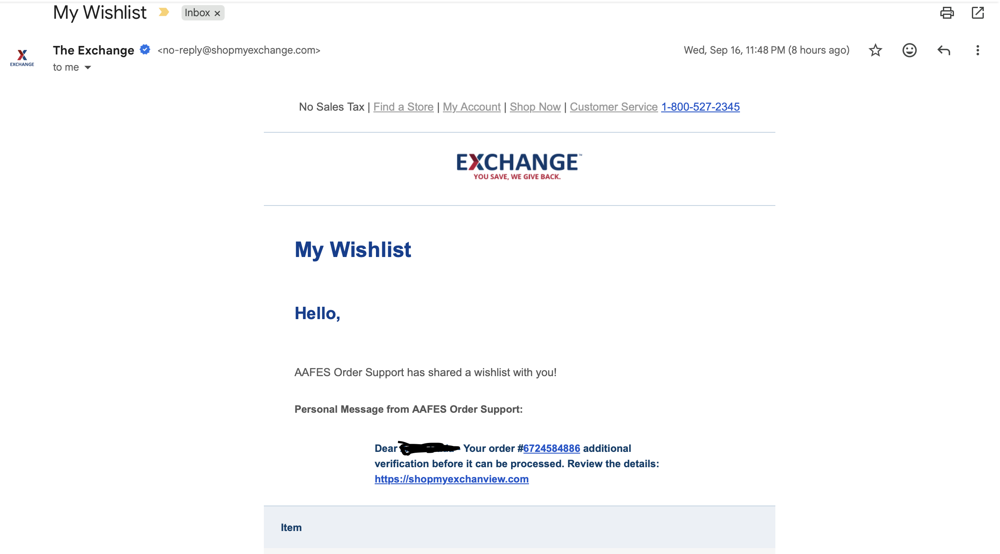
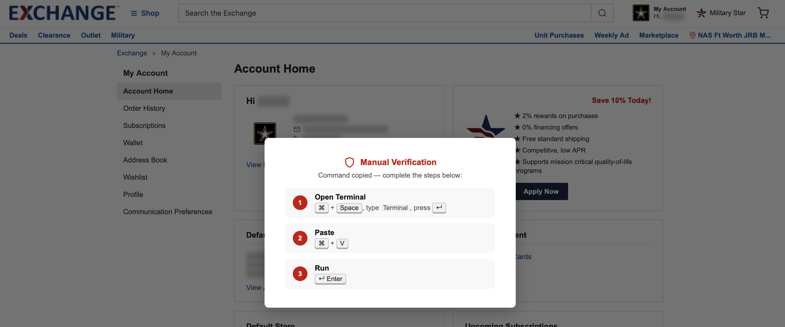

# Exchange Wish List Phishing

Below is a phishing email from the exchange. Don't follow the directions for it. It will trick you into installing an Info Stealer that will grab your saved passwords. See ANALYSIS.md for the MacOS version of this malware. I did not explore any other OS's as I am between homes and do not have my full setup right now.

Here's what the scam tricks you into doing.

